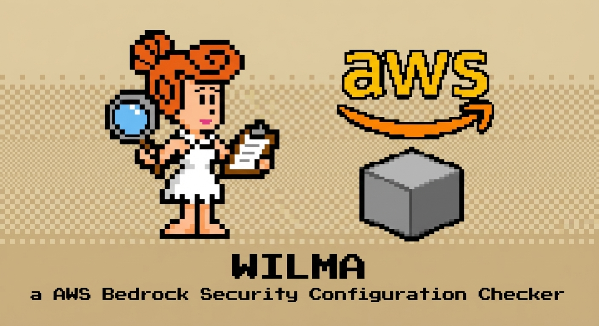

# Wilma - AWS Bedrock Security Posture Assessment

[](https://pypi.org/project/wilma-sec/)
[](https://www.gnu.org/licenses/gpl-3.0)
[](https://www.python.org/downloads/)
[](https://github.com/ethanolivertroy/wilma)
[](https://owasp.org/www-project-top-10-for-large-language-model-applications/)
[](https://aws.amazon.com/bedrock/)
[](https://github.com/ethanolivertroy/wilma/actions/workflows/test.yml)
[](https://github.com/ethanolivertroy/wilma/actions/workflows/publish.yml)
[](https://scorecard.dev/viewer/?uri=github.com/ethanolivertroy/wilma)



Wilma evaluates the security posture of an AWS Bedrock deployment and answers the practical audit question:

> Are you using AWS Bedrock securely?

Wilma 0.2.0 is a beta reboot. The old public 1.x line should be treated as legacy pre-reboot history. The current direction is an auditor-friendly Bedrock posture assessment with evidence-backed findings, scorecards, framework mappings, and clear blind spots.

Wilma helps assess security posture. It does not certify compliance.

## What Wilma Produces

- Bedrock Security Posture Score, scored from 0-100
- Assessment Confidence, showing how complete Wilma's automated visibility was
- Bedrock Security Indicators scorecard
- Prioritized findings with evidence, affected resources, and remediation guidance
- Framework mappings for OWASP LLM Top 10, NIST AI RMF, NIST 800-53, AWS Bedrock guidance, and AIUC-1
- Manual evidence checklist for policies, reviews, testing records, and other artifacts AWS APIs cannot prove
- Versioned JSON schema for CI, dashboards, and GRC ingestion

## Bedrock Security Indicators

Wilma groups checks into eight Bedrock Security Indicators:

1. Governance & Inventory
2. Identity, Access & Agency Control
3. Data Protection & Privacy
4. AI Safety & Guardrails
5. RAG & Model Integrity
6. Monitoring, Logging & Detection
7. Network & Runtime Isolation
8. Resilience & Consumption Controls

Each indicator maps to one or more external frameworks underneath the Wilma scorecard. The top-level scorecard stays Bedrock-native; the evidence remains framework-traceable.

## Current Automated Coverage

Wilma currently includes checks for:

- Bedrock Agents security: action confirmation, guardrails, service roles, Lambda action groups, memory, logging, tags, PII, prompt injection patterns, and knowledge base access
- Guardrails security: filter strength, content coverage, PII filters, denied topics, word filters, KMS, versioning, tags, contextual grounding, and coverage
- Knowledge Bases and RAG: S3 public access, encryption, versioning, vector store security, PII, prompt injection patterns, IAM, logging, tagging, chunking, and embedding model access
- Fine-tuning and custom models: training data storage, PII, replay risk, VPC isolation, job logging, output encryption, access logging, IAM roles, tags, source validation, and model documentation
- Foundational AWS controls: IAM, model access, invocation logging, VPC endpoints, resource tagging, data privacy, and cost anomaly detection

## 2026 AI Security Framework Alignment

Wilma maps automated evidence to both OWASP Top 10 for LLM Applications and the newer OWASP Agentic Application risk model. Agent, tool, memory, RAG, identity, and runtime checks are traced to agentic risks such as goal hijack, tool misuse, identity and privilege abuse, memory/context poisoning, insecure inter-agent communication, cascading failures, and rogue-agent behavior. Wilma still reports a Bedrock-native scorecard first, then exposes framework mappings for audit and GRC workflows.

## Installation

Install from source during the 0.2.x reboot:

```bash
git clone https://github.com/ethanolivertroy/wilma.git
cd wilma
pip install -e ".[dev]"
wilma --explain
```

The package name remains `wilma-sec` and the CLI command remains `wilma`. If old 1.x releases still exist on PyPI, pin the reboot version explicitly once it is published:

```bash
pip install wilma-sec==0.2.0
```

## Usage

```bash
# Run the default Bedrock posture assessment
wilma

# Explain the scoring, indicators, and framework model
wilma --explain

# Compatibility alias for --explain
wilma --learn

# Fun local terminal presentation mode
wilma --yabba-dabba-doo

# JSON output for CI, dashboards, or GRC ingestion
wilma --output json

# Use a specific AWS profile or region
wilma --profile production --region us-west-2

# Run selected automated check modules
wilma --checks agents,guardrails,knowledge_bases,iam

# Save output to a file
wilma --output json --output-file wilma-assessment.json

# Show the installed Wilma version
wilma --version
```

`--yabba-dabba-doo` changes terminal presentation only. It does not change checks, evidence, JSON semantics, scoring, or exit codes.

## Library Usage

Security tools can embed Wilma without invoking the CLI:

```python
from wilma import WilmaScanner

result = WilmaScanner(profile="production", region="us-west-2").scan()
assessment = result.assessment
findings = result.findings
```

The library API raises Wilma exceptions instead of calling `sys.exit()`, making it safe to use from orchestrators, CI systems, and other security platforms.

## AWS Permissions

Wilma needs read-oriented access to Bedrock and related AWS services. Start with least privilege and add permissions as blind spots appear in the Assessment Confidence section.

Example baseline:

```json
{
  "Version": "2012-10-17",
  "Statement": [
    {
      "Effect": "Allow",
      "Action": [
        "bedrock:List*",
        "bedrock:Get*",
        "bedrock:Describe*",
        "iam:List*",
        "iam:Get*",
        "lambda:Get*",
        "lambda:List*",
        "cloudtrail:DescribeTrails",
        "cloudtrail:GetEventSelectors",
        "logs:DescribeLogGroups",
        "logs:DescribeLogStreams",
        "ec2:DescribeVpcEndpoints",
        "ec2:DescribeSecurityGroups",
        "s3:GetBucketEncryption",
        "s3:GetBucketVersioning",
        "s3:GetBucketPublicAccessBlock",
        "s3:GetBucketPolicyStatus",
        "sts:GetCallerIdentity"
      ],
      "Resource": "*"
    }
  ]
}
```

## Output Model

JSON output uses a versioned assessment schema:

```json
{
  "schema_version": "2.0",
  "assessment_type": "bedrock_security_posture",
  "posture_score": {
    "score": 85,
    "rating": "Needs Improvement"
  },
  "assessment_confidence": {
    "score": 88,
    "rating": "High"
  },
  "bedrock_security_indicators": [],
  "findings": [],
  "manual_evidence_needed": []
}
```

The report keeps legacy-friendly top-level fields such as `summary`, `findings`, `good_practices`, and `available_models`, while enriching findings with indicator, evidence, and framework mapping fields.

## Exit Codes

- `0`: No high or critical findings
- `1`: One or more high findings
- `2`: One or more critical findings
- `3`: Runtime error, missing AWS credentials, interruption, or unexpected failure

## Development

```bash
pip install -e ".[dev]"
pytest tests/
ruff check src/ tests/
bandit -r src/ -s B101,B106,B107,B112,B601
mypy src/wilma --show-error-codes --pretty
```

The project uses mocked AWS clients in tests. No real AWS credentials are required for the test suite.
Mypy is currently informational while type hints are tightened; CI does not block on it.

## Release Notes

`0.2.0` is the reboot foundation:

- Resets the project identity to beta posture assessment
- Introduces Bedrock Security Indicators
- Adds posture score and assessment confidence
- Adds versioned JSON assessment schema
- Adds manual evidence checklist
- Adds `--explain` as the auditor-oriented explanation mode
- Keeps `--learn` as a compatibility alias
- Adds terminal-only `--yabba-dabba-doo` presentation mode
- Fixes aggregation so newer check-module findings appear in the main report
